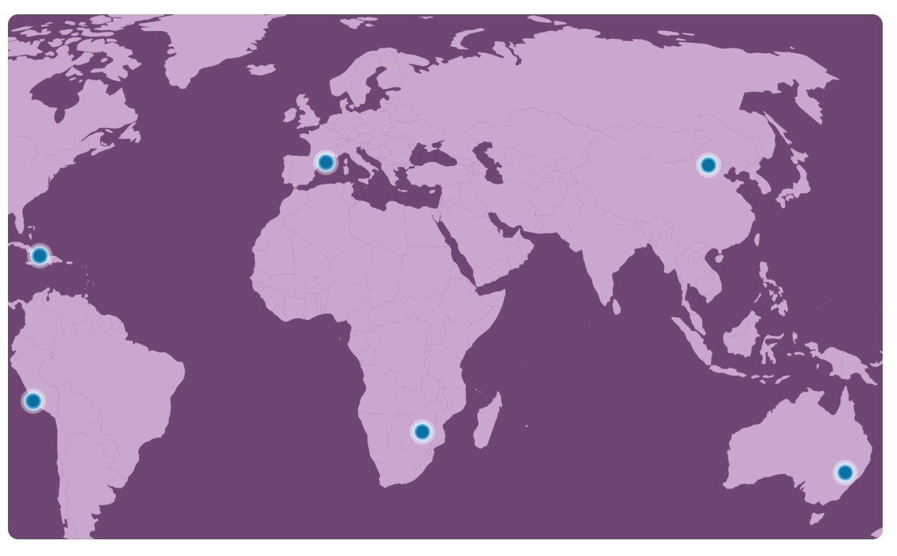

# Lancet Countdown 2026

## Overview

The **Lancet Countdown on Climate Change and Health** is an international research collaboration, funded by Wellcome and based at UCL. It brings together over 300 researchers worldwide to ensure health is central to climate action and to inform policies that protect and improve population health.
The Lancet Countdown is made up of individuals and organisations from all over the world, that are committed to changing the way we think about climate change and health. Our Regional Centres in Asia, Africa, Europe, Oceania, Small Island Developing States (SIDS) and Latin America expand on our global data monitoring and analysis, looking at the local and national implications on public health.

<p align="center">
  
</p>

This repository supports the development of the **Lancet Countdown 2026 Report**, providing a structured and collaborative environment for authors across Working Groups (WGs) to contribute, review, and manage indicator content.

---

## What We Do

The Lancet Countdown works to ensure that health is central to climate action by producing high-quality scientific evidence and analysis.

Our work:
- Tracks global progress on climate change and health indicators  
- Provides evidence to inform public policy and decision-making  
- Identifies health risks and opportunities linked to climate change  
- Highlights the health co-benefits of climate mitigation and adaptation  

The findings are published annually in *The Lancet*.

---

## Background

The Lancet Countdown builds on the 2015 Lancet Commission, which concluded:

> “Tackling climate change could be the greatest global health opportunity of the 21st century.”

In response, the Lancet Countdown was established in 2016 to create a global monitoring system that tracks the links between climate change and human health.

The collaboration:
- Is hosted by **University College London (UCL)**  
- Receives strategic and financial support from the **Wellcome Trust**  
- Involves nearly **300 researchers worldwide**  
- Publishes annual reports in *The Lancet*  

---

## Repository Structure

This repository is organised by **Working Groups (WG1–WG5)** and **Indicators**.

```text
WG1/
WG2/
WG3/
WG4/
WG5/
indicator_template/
```

Each indicator follows a standard structure:

```text
IND-x.x.x-indicator-name/
├── README.md
├── methods/
├── code/
└── additional-analysis/
   
```
## Purpose of This Repository

This repository is designed to:

- Support collaborative writing across global teams  
- Maintain consistency across indicators and working groups  
- Enable transparent version control and review  
- Ensure reproducibility of analyses  

---
## Collaboration

The Lancet Countdown is a global collaboration involving:
- Researchers
- Policymakers
- Public health experts

Working together to understand and address the health impacts of climate change.

---

## License

This project is licensed under the MIT License.

---

## Contact

For questions, please contact the repository maintainer or your Working Group lead.
